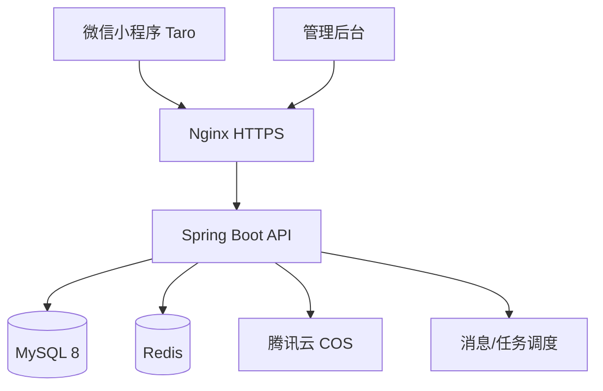
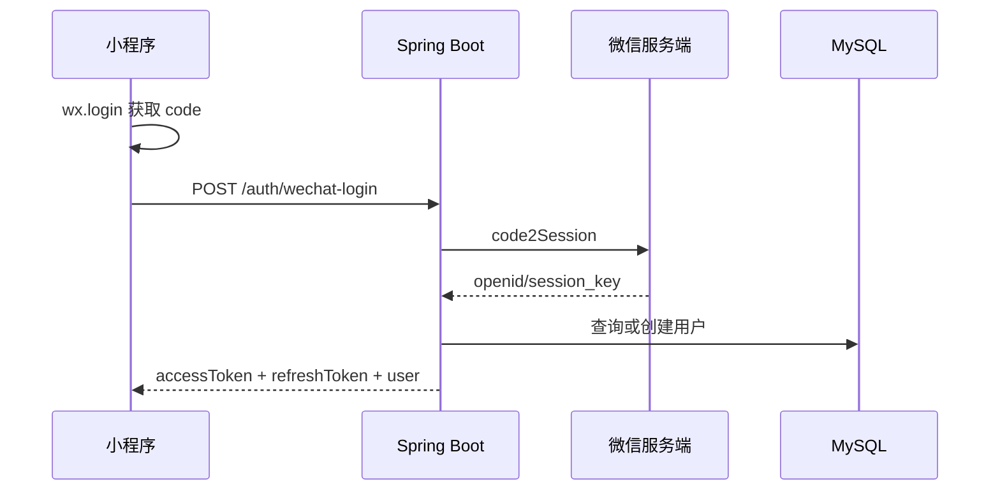
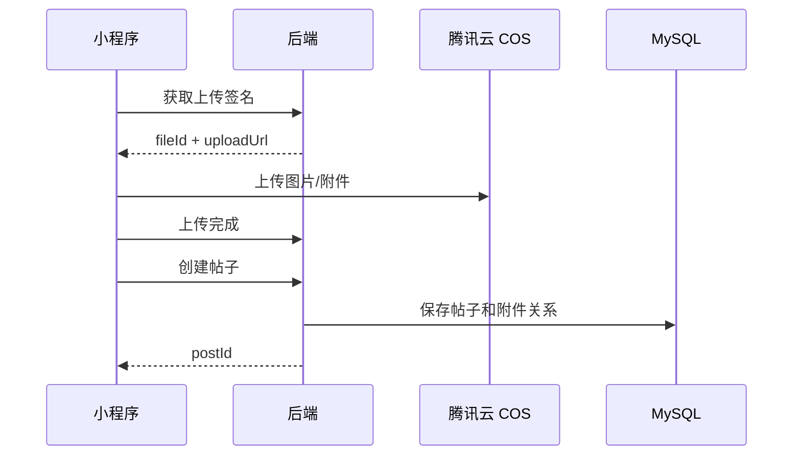
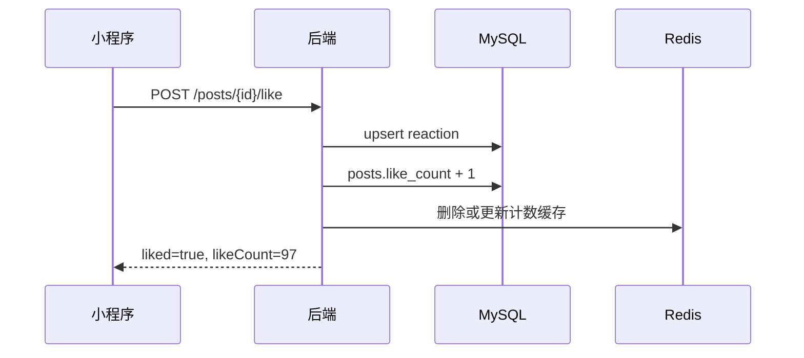

# 城院圈后端设计报告

## 1. 项目背景

城院圈是面向武汉城市学院校园场景的小程序社区产品。当前前端已经完成主要页面 UI 和基础交互，包括首页、论坛页、文章页、消息页、用户页、登录页、注册页等。前端目前通过 `miniapp/src/services` 中的 `ServiceAdapter` 读取 mock 数据，后端建设的第一目标是替换 mock adapter，为现有页面提供稳定、可分页、可扩展的真实接口。

本报告基于当前前端程序结构编写，后端技术路线采用：

- Java 21
- Spring Boot 3
- MySQL 8
- Redis
- MyBatis-Plus
- Spring Security + JWT
- 腾讯云 COS + CDN
- Knife4j / OpenAPI
- Docker + Nginx

## 2. 当前前端能力梳理

### 2.1 小程序页面

当前 `miniapp/src/app.config.ts` 中已注册页面：

| 页面 | 路径 | 后端支撑能力 |
|---|---|---|
| 首页 | `/pages/home/index` | 首页配置、快捷模块、校园头条、搜索 |
| 发现页 | `/pages/discover/index` | 板块列表、今日帖子数 |
| 论坛页 | `/pages/forum/index` | 热门话题、帖子流、帖子搜索、模块筛选 |
| 文章页 | `/pages/article/index` | 帖子详情、附件、评论、点赞、收藏 |
| 消息页 | `/pages/messages/index` | 消息分类、消息列表、未读数、全部已读 |
| 用户页 | `/pages/profile/index` | 用户资料、宿舍用电、我的服务、退出登录 |
| 登录页 | `/pages/login/index` | 账号登录、微信登录、统一认证入口 |
| 注册页 | `/pages/register/index` | 学号注册、验证码、学院选择、协议确认 |

### 2.2 前端服务接口现状

前端服务抽象位于 `miniapp/src/services/index.ts`：

| 前端方法 | 当前用途 | 建议后端接口 |
|---|---|---|
| `getHomeData()` | 首页首屏数据 | `GET /api/v1/home` |
| `getForumData()` | 论坛页数据 | `GET /api/v1/forum/overview` |
| `getArticleData(id)` | 文章详情 | `GET /api/v1/posts/{postId}` |
| `getDiscoverCategories()` | 发现页板块 | `GET /api/v1/modules` |
| `getMessages()` | 消息列表 | `GET /api/v1/messages` |
| `getProfileData()` | 用户页资料 | `GET /api/v1/me/profile` |

第一版后端应优先兼容这些聚合接口，降低前端接入成本。后续再拆为更细粒度的列表、详情和操作接口。

## 3. 后端建设目标

### 3.1 第一阶段目标

- 支持真实登录态，替换测试登录。
- 支持首页、论坛、文章、消息、个人中心数据读取。
- 支持发帖、评论、点赞、收藏、关注。
- 支持腾讯云 COS 文件上传签名。
- 支持消息未读数、全部已读。
- 支持基础内容审核和管理后台预留。
- 支持接口文档、统一响应、统一错误码。

### 3.2 第二阶段目标

- 支持帖子搜索、热门话题、推荐流。
- 支持二手交易扩展字段。
- 支持校园活动、报名提醒。
- 支持宿舍用电数据对接或定时同步。
- 支持举报、封禁、敏感词审核。
- 支持后台管理端。

## 4. 总体架构设计



### 4.1 分层结构

```text
com.leafone
  ├── LeafOneApplication
  ├── common
  │   ├── config
  │   ├── exception
  │   ├── response
  │   ├── security
  │   └── util
  ├── auth
  ├── user
  ├── module
  ├── post
  ├── comment
  ├── reaction
  ├── message
  ├── upload
  ├── profile
  ├── search
  └── admin
```

### 4.2 模块职责

| 模块 | 说明 |
|---|---|
| `auth` | 登录、注册、JWT、微信 code 登录、退出登录 |
| `user` | 用户资料、学生认证、关注关系 |
| `module` | 学习互助、二手交易、食堂点评等板块 |
| `post` | 帖子发布、列表、详情、附件、计数 |
| `comment` | 评论、回复、评论点赞 |
| `reaction` | 点赞、收藏、分享计数 |
| `message` | 通知、互动消息、未读数、全部已读 |
| `upload` | COS 上传签名、附件记录 |
| `profile` | 用户页聚合数据、宿舍用电、我的服务 |
| `search` | 搜索聚合，前期基于 MySQL LIKE / FULLTEXT |
| `admin` | 审核、举报、封禁、配置管理 |

## 5. 技术选型说明

### 5.1 Spring Boot 3

选择 Spring Boot 3 的主要原因：

- Java 生态成熟，长期维护成本低。
- 与 MySQL、Redis、消息队列、对象存储集成成熟。
- 适合论坛类产品后续扩展管理后台、审核系统、权限系统。
- 国内 Java 后端经验和资料非常多。

### 5.2 MySQL 8

第一版选择 MySQL 8：

- 对论坛 CRUD、评论、点赞、消息这类关系型数据足够稳定。
- Spring Boot + MyBatis-Plus 组合成熟。
- 国内云厂商托管 MySQL 和运维经验更普遍。
- 后续如搜索复杂，可再引入专门搜索服务，而不是一开始增加数据库学习成本。

### 5.3 Redis

Redis 用于：

- 登录 token 黑名单或 refresh token 会话。
- 短信/邮箱验证码缓存。
- 限流。
- 热门帖子、热门话题缓存。
- 帖子点赞数、评论数、收藏数短期缓存。
- 消息未读数缓存。

### 5.4 腾讯云 COS

图片、附件、头像、文章资料不走应用服务器转发。后端只负责：

- 校验登录态。
- 生成临时上传凭证或预签名 URL。
- 保存文件元数据。
- 绑定文件到帖子、评论或用户头像。

## 6. 数据库设计

### 6.1 命名规范

- 表名使用小写下划线：`posts`、`post_comments`。
- 主键统一使用 `BIGINT` 雪花 ID 或数据库自增 ID。建议第一版使用雪花 ID，方便后续分库。
- 时间字段统一：`created_at`、`updated_at`、`deleted_at`。
- 软删除字段：`deleted_at DATETIME NULL`。
- 状态字段使用 `TINYINT` 或 `VARCHAR(32)`，业务枚举在代码中定义。

### 6.2 用户表 `users`

| 字段 | 类型 | 说明 |
|---|---|---|
| `id` | BIGINT PK | 用户 ID |
| `openid` | VARCHAR(64) UNIQUE | 微信 openid |
| `unionid` | VARCHAR(64) NULL | 微信 unionid |
| `phone` | VARCHAR(20) NULL | 手机号 |
| `student_no` | VARCHAR(32) NULL | 学号 |
| `password_hash` | VARCHAR(255) NULL | 密码哈希 |
| `nickname` | VARCHAR(64) | 昵称 |
| `avatar_url` | VARCHAR(512) | 头像 |
| `gender` | TINYINT | 性别 |
| `role` | VARCHAR(32) | `USER` / `ADMIN` |
| `status` | TINYINT | 1 正常，2 禁用 |
| `last_login_at` | DATETIME | 最近登录时间 |
| `created_at` | DATETIME | 创建时间 |
| `updated_at` | DATETIME | 更新时间 |
| `deleted_at` | DATETIME NULL | 删除时间 |

索引：

- `uk_users_openid(openid)`
- `uk_users_student_no(student_no)`
- `idx_users_phone(phone)`

### 6.3 学生资料表 `student_profiles`

| 字段 | 类型 | 说明 |
|---|---|---|
| `id` | BIGINT PK | ID |
| `user_id` | BIGINT | 用户 ID |
| `real_name` | VARCHAR(64) | 姓名 |
| `student_no` | VARCHAR(32) | 学号 |
| `college` | VARCHAR(128) | 学院 |
| `major` | VARCHAR(128) | 专业 |
| `grade` | VARCHAR(32) | 年级 |
| `identity_label` | VARCHAR(32) | 学长、大二等身份标签 |
| `verified` | TINYINT | 是否认证 |
| `created_at` | DATETIME | 创建时间 |
| `updated_at` | DATETIME | 更新时间 |

### 6.4 板块表 `modules`

对应首页八宫格、发现页分类、论坛模块。

| 字段 | 类型 | 说明 |
|---|---|---|
| `id` | BIGINT PK | 板块 ID |
| `code` | VARCHAR(64) UNIQUE | `learn`、`trade`、`canteen` |
| `name` | VARCHAR(64) | 板块名称 |
| `description` | VARCHAR(255) | 板块描述 |
| `icon_key` | VARCHAR(64) | 前端图标 key |
| `sort_order` | INT | 排序 |
| `post_count_today` | INT | 今日帖子数，可定时刷新 |
| `enabled` | TINYINT | 是否启用 |
| `created_at` | DATETIME | 创建时间 |
| `updated_at` | DATETIME | 更新时间 |

### 6.5 帖子表 `posts`

| 字段 | 类型 | 说明 |
|---|---|---|
| `id` | BIGINT PK | 帖子 ID |
| `author_id` | BIGINT | 作者 ID |
| `module_id` | BIGINT | 板块 ID |
| `title` | VARCHAR(120) | 标题 |
| `summary` | VARCHAR(255) | 摘要 |
| `content` | TEXT | 正文 |
| `cover_url` | VARCHAR(512) NULL | 封面图 |
| `cover_type` | VARCHAR(32) NULL | 前端兼容字段 |
| `price` | DECIMAL(10,2) NULL | 二手交易价格 |
| `location_name` | VARCHAR(128) NULL | 发布地点 |
| `status` | TINYINT | 0 草稿，1 已发布，2 审核中，3 驳回，4 下架 |
| `is_pinned` | TINYINT | 是否置顶 |
| `is_featured` | TINYINT | 是否推荐 |
| `view_count` | INT | 浏览数 |
| `share_count` | INT | 分享数 |
| `comment_count` | INT | 评论数 |
| `like_count` | INT | 点赞数 |
| `favorite_count` | INT | 收藏数 |
| `published_at` | DATETIME | 发布时间 |
| `created_at` | DATETIME | 创建时间 |
| `updated_at` | DATETIME | 更新时间 |
| `deleted_at` | DATETIME NULL | 删除时间 |

索引：

- `idx_posts_module_status_time(module_id, status, published_at)`
- `idx_posts_author_time(author_id, published_at)`
- `idx_posts_featured_time(is_featured, published_at)`
- `idx_posts_pinned_time(is_pinned, published_at)`
- 第一版搜索可加 `FULLTEXT(title, summary, content)`，中文分词效果不足时再接搜索服务。

### 6.6 帖子附件表 `post_attachments`

| 字段 | 类型 | 说明 |
|---|---|---|
| `id` | BIGINT PK | 附件 ID |
| `post_id` | BIGINT | 帖子 ID |
| `file_id` | BIGINT | 文件 ID |
| `display_name` | VARCHAR(255) | 展示文件名 |
| `sort_order` | INT | 排序 |
| `created_at` | DATETIME | 创建时间 |

### 6.7 文件表 `files`

| 字段 | 类型 | 说明 |
|---|---|---|
| `id` | BIGINT PK | 文件 ID |
| `owner_id` | BIGINT | 上传用户 |
| `bucket` | VARCHAR(128) | COS bucket |
| `object_key` | VARCHAR(512) | COS object key |
| `url` | VARCHAR(512) | CDN 访问 URL |
| `mime_type` | VARCHAR(128) | MIME |
| `file_type` | VARCHAR(32) | `image`、`pdf`、`doc`、`excel` |
| `size_bytes` | BIGINT | 文件大小 |
| `sha256` | VARCHAR(128) NULL | 文件摘要 |
| `status` | TINYINT | 1 正常，2 待审核，3 禁用 |
| `created_at` | DATETIME | 创建时间 |

### 6.8 评论表 `post_comments`

| 字段 | 类型 | 说明 |
|---|---|---|
| `id` | BIGINT PK | 评论 ID |
| `post_id` | BIGINT | 帖子 ID |
| `user_id` | BIGINT | 评论用户 |
| `parent_id` | BIGINT NULL | 父评论 ID |
| `reply_to_user_id` | BIGINT NULL | 回复目标用户 |
| `content` | VARCHAR(1000) | 评论内容 |
| `like_count` | INT | 点赞数 |
| `status` | TINYINT | 1 正常，2 审核中，3 删除 |
| `created_at` | DATETIME | 创建时间 |
| `updated_at` | DATETIME | 更新时间 |
| `deleted_at` | DATETIME NULL | 删除时间 |

索引：

- `idx_comments_post_time(post_id, created_at)`
- `idx_comments_parent_time(parent_id, created_at)`

### 6.9 互动表 `reactions`

统一存储点赞、收藏等用户行为。

| 字段 | 类型 | 说明 |
|---|---|---|
| `id` | BIGINT PK | ID |
| `user_id` | BIGINT | 用户 ID |
| `target_type` | VARCHAR(32) | `POST` / `COMMENT` |
| `target_id` | BIGINT | 目标 ID |
| `reaction_type` | VARCHAR(32) | `LIKE` / `FAVORITE` |
| `created_at` | DATETIME | 创建时间 |
| `deleted_at` | DATETIME NULL | 取消时间 |

唯一索引：

- `uk_reaction(user_id, target_type, target_id, reaction_type)`

说明：

- 点赞取消时建议软删除或更新 `deleted_at`。
- 帖子点赞和评论点赞都走同一张表。
- 收藏仅对 `POST` 开放。

### 6.10 关注表 `user_follows`

| 字段 | 类型 | 说明 |
|---|---|---|
| `id` | BIGINT PK | ID |
| `follower_id` | BIGINT | 关注者 |
| `following_id` | BIGINT | 被关注者 |
| `created_at` | DATETIME | 创建时间 |
| `deleted_at` | DATETIME NULL | 取消关注时间 |

唯一索引：

- `uk_follow(follower_id, following_id)`

### 6.11 话题表 `topics`

| 字段 | 类型 | 说明 |
|---|---|---|
| `id` | BIGINT PK | 话题 ID |
| `name` | VARCHAR(64) | 话题名 |
| `description` | VARCHAR(255) | 描述 |
| `heat_score` | INT | 热度分 |
| `post_count` | INT | 帖子数 |
| `enabled` | TINYINT | 是否启用 |
| `created_at` | DATETIME | 创建时间 |
| `updated_at` | DATETIME | 更新时间 |

### 6.12 消息表 `messages`

| 字段 | 类型 | 说明 |
|---|---|---|
| `id` | BIGINT PK | 消息 ID |
| `user_id` | BIGINT | 接收者 |
| `sender_id` | BIGINT NULL | 触发者 |
| `type` | VARCHAR(32) | `NOTICE`、`REPLY`、`LIKE`、`FOLLOW`、`ACTIVITY`、`CARD`、`SYSTEM` |
| `title` | VARCHAR(64) | 标题 |
| `content` | VARCHAR(255) | 内容 |
| `target_type` | VARCHAR(32) NULL | 跳转目标类型 |
| `target_id` | BIGINT NULL | 跳转目标 ID |
| `read_at` | DATETIME NULL | 已读时间 |
| `created_at` | DATETIME | 创建时间 |
| `deleted_at` | DATETIME NULL | 删除时间 |

索引：

- `idx_messages_user_read_time(user_id, read_at, created_at)`
- `idx_messages_user_type_time(user_id, type, created_at)`

### 6.13 首页内容表 `home_headlines`

| 字段 | 类型 | 说明 |
|---|---|---|
| `id` | BIGINT PK | ID |
| `title` | VARCHAR(128) | 标题 |
| `summary` | VARCHAR(255) | 摘要 |
| `cover_url` | VARCHAR(512) | 封面 |
| `target_type` | VARCHAR(32) | `POST` / `URL` / `ACTIVITY` |
| `target_id` | BIGINT NULL | 目标 ID |
| `external_url` | VARCHAR(512) NULL | 外链 |
| `is_pinned` | TINYINT | 是否置顶 |
| `view_count` | INT | 浏览量 |
| `published_at` | DATETIME | 发布时间 |
| `created_at` | DATETIME | 创建时间 |
| `updated_at` | DATETIME | 更新时间 |

### 6.14 宿舍用电表 `dorm_power_records`

用户页当前展示“宿舍用电”和 72 小时趋势图，第一版可先用 mock 或后台录入，后续再对接学校系统。

| 字段 | 类型 | 说明 |
|---|---|---|
| `id` | BIGINT PK | ID |
| `user_id` | BIGINT | 用户 ID |
| `room_name` | VARCHAR(64) | 宿舍，如桂园6舍305 |
| `record_time` | DATETIME | 记录时间 |
| `power_kwh` | DECIMAL(10,2) | 用电量 |
| `record_type` | VARCHAR(16) | `HOURLY` / `DAILY` / `MONTHLY` |
| `created_at` | DATETIME | 创建时间 |

### 6.15 反馈表 `feedbacks`

| 字段 | 类型 | 说明 |
|---|---|---|
| `id` | BIGINT PK | ID |
| `user_id` | BIGINT | 用户 ID |
| `content` | VARCHAR(1000) | 反馈内容 |
| `contact` | VARCHAR(64) NULL | 联系方式 |
| `status` | VARCHAR(32) | `PENDING` / `PROCESSING` / `DONE` |
| `created_at` | DATETIME | 创建时间 |
| `updated_at` | DATETIME | 更新时间 |

## 7. API 设计

### 7.1 通用规范

基础路径：

```text
/api/v1
```

统一响应：

```json
{
  "code": 0,
  "message": "success",
  "data": {},
  "requestId": "202604291530000001"
}
```

分页响应：

```json
{
  "code": 0,
  "message": "success",
  "data": {
    "items": [],
    "page": 1,
    "pageSize": 20,
    "total": 100,
    "hasMore": true
  }
}
```

鉴权 Header：

```http
Authorization: Bearer <access_token>
```

### 7.2 错误码

| code | 说明 |
|---|---|
| `0` | 成功 |
| `40000` | 参数错误 |
| `40100` | 未登录 |
| `40300` | 无权限 |
| `40400` | 资源不存在 |
| `40900` | 状态冲突，例如重复点赞 |
| `42900` | 请求过于频繁 |
| `50000` | 服务端错误 |

### 7.3 登录注册接口

#### 账号密码登录

```http
POST /api/v1/auth/login
```

请求：

```json
{
  "account": "2022123456",
  "password": "123456",
  "remember": true
}
```

响应：

```json
{
  "accessToken": "jwt",
  "refreshToken": "refresh-token",
  "expiresIn": 7200,
  "user": {
    "id": "10001",
    "nickname": "林一航",
    "avatarUrl": "https://image.opxqo.cn/avatar/eg/001.webp",
    "identity": "计算机学院 · 2021级"
  }
}
```

#### 微信登录

```http
POST /api/v1/auth/wechat-login
```

请求：

```json
{
  "code": "wx.login code",
  "encryptedData": "",
  "iv": ""
}
```

说明：

- 小程序端调用 `wx.login` 获取 code。
- 后端调用微信 `code2Session` 换取 openid。
- 若 openid 未绑定学生资料，返回 `needBindStudent: true`。

#### 注册

```http
POST /api/v1/auth/register
```

请求：

```json
{
  "realName": "林一航",
  "studentNo": "2022123456",
  "college": "计算机学院",
  "phone": "13800000000",
  "code": "123456",
  "password": "123456",
  "agreePolicy": true
}
```

#### 退出登录

```http
POST /api/v1/auth/logout
```

### 7.4 首页接口

#### 首页聚合

```http
GET /api/v1/home
```

响应字段需要兼容前端 `HomeData`：

```json
{
  "greeting": "你好，欢迎来到",
  "title": "武汉城市学院论坛",
  "subtitle": "WUHAN CITY COLLEGE",
  "shortcuts": [
    {
      "id": "learn",
      "title": "学习互助",
      "icon": "icon-learn"
    }
  ],
  "headlines": [
    {
      "id": "news-1",
      "title": "武汉城市学院2024届毕业典礼圆满落幕",
      "summary": "愿此去繁花似锦，归来仍是少年",
      "date": "05-18",
      "views": "2.2k浏览",
      "image": "https://..."
    }
  ],
  "bannerTitle": "校园开放日",
  "bannerSubtitle": "相约城院，共赴未来"
}
```

#### 首页搜索

```http
GET /api/v1/search?keyword=期末&type=all&page=1&pageSize=20
```

搜索范围：

- 帖子标题、正文、作者。
- 校园头条。
- 话题。
- 板块。

第一版也可以先只搜索帖子和头条。

### 7.5 发现页接口

```http
GET /api/v1/modules
```

响应：

```json
[
  {
    "id": "learn",
    "title": "学习互助",
    "description": "问答解惑，资料分享，互帮互助",
    "todayCount": 256
  }
]
```

### 7.6 论坛接口

#### 论坛聚合

```http
GET /api/v1/forum/overview
```

响应兼容前端 `ForumData`：

```json
{
  "topics": [
    {
      "id": "topic-1",
      "label": "# 考研互助打卡",
      "heat": "1.2w 讨论"
    }
  ],
  "posts": [
    {
      "id": "post-1",
      "author": "计算机小林学长",
      "badge": "学长",
      "meta": "2分钟前 计算机学院",
      "title": "Python期末复习资料整理（附网盘）",
      "summary": "整理了一些Python期末复习资料和习题...",
      "module": "学习互助",
      "avatar": "https://image.opxqo.cn/avatar/eg/001.webp",
      "coverType": "python",
      "avatarTone": "male",
      "stats": {
        "share": 12,
        "comment": 48,
        "like": 96
      }
    }
  ]
}
```

#### 帖子列表

```http
GET /api/v1/posts?module=learn&tab=latest&keyword=python&page=1&pageSize=20
```

参数：

| 参数 | 说明 |
|---|---|
| `module` | 板块 code |
| `tab` | `latest` / `recommend` / `following` |
| `keyword` | 搜索关键词 |
| `topicId` | 话题 ID |
| `page` | 页码 |
| `pageSize` | 每页数量 |

#### 发布帖子

```http
POST /api/v1/posts
```

请求：

```json
{
  "moduleCode": "learn",
  "title": "Python期末复习资料整理（附网盘）",
  "content": "整理了一些Python期末复习资料...",
  "summary": "整理了一些Python期末复习资料和习题...",
  "coverFileId": "20001",
  "attachmentFileIds": ["20002", "20003"],
  "locationName": "计算机学院教学楼 3号楼",
  "price": null,
  "topicIds": ["30001"]
}
```

#### 帖子详情

```http
GET /api/v1/posts/{postId}
```

响应兼容前端 `ArticleData`，并额外返回互动状态：

```json
{
  "id": "post-1",
  "author": "计算机小林学长",
  "authorMeta": "05-18 14:32 发布于 校园论坛",
  "authorAvatar": "https://...",
  "authorBadge": "学长",
  "title": "Python期末复习资料整理（附网盘）",
  "intro": "整理了一些Python期末复习资料...",
  "content": "完整正文",
  "bulletPoints": [
    "Python重点知识总结.pdf"
  ],
  "link": "https://pan.baidu.com/s/xxxxxx",
  "linkCode": "py666",
  "locationName": "计算机学院教学楼 3号楼",
  "stats": {
    "share": 12,
    "comment": 48,
    "like": 96,
    "favorite": 16
  },
  "viewerState": {
    "liked": false,
    "favorited": false,
    "followedAuthor": false
  },
  "attachments": [],
  "comments": []
}
```

#### 分享计数

```http
POST /api/v1/posts/{postId}/share
```

说明：前端触发系统分享成功后调用，增加分享数。

### 7.7 点赞收藏接口

#### 点赞帖子

```http
POST /api/v1/posts/{postId}/like
```

响应：

```json
{
  "liked": true,
  "likeCount": 97
}
```

#### 取消帖子点赞

```http
DELETE /api/v1/posts/{postId}/like
```

#### 收藏帖子

```http
POST /api/v1/posts/{postId}/favorite
```

响应：

```json
{
  "favorited": true,
  "favoriteCount": 17
}
```

#### 取消收藏

```http
DELETE /api/v1/posts/{postId}/favorite
```

#### 评论点赞

```http
POST /api/v1/comments/{commentId}/like
DELETE /api/v1/comments/{commentId}/like
```

### 7.8 评论接口

#### 评论列表

```http
GET /api/v1/posts/{postId}/comments?sort=default&page=1&pageSize=20
```

#### 发表评论

```http
POST /api/v1/posts/{postId}/comments
```

请求：

```json
{
  "content": "太棒了！正好需要，感谢学长分享～",
  "parentId": null,
  "replyToUserId": null
}
```

#### 删除评论

```http
DELETE /api/v1/comments/{commentId}
```

### 7.9 消息接口

#### 消息聚合

```http
GET /api/v1/messages/overview
```

返回顶部四个入口未读数：

```json
{
  "noticeUnread": 8,
  "interactionUnread": 12,
  "likeUnread": 5,
  "followUnread": 0
}
```

#### 消息列表

```http
GET /api/v1/messages?type=all&page=1&pageSize=20
```

响应兼容 `MessageItem`：

```json
[
  {
    "id": "message-1",
    "title": "学校通知",
    "detail": "关于2024年五一放假安排的通知",
    "time": "09:32",
    "unread": 1
  }
]
```

#### 全部已读

```http
POST /api/v1/messages/read-all
```

#### 单条已读

```http
POST /api/v1/messages/{messageId}/read
```

### 7.10 用户页接口

#### 用户资料聚合

```http
GET /api/v1/me/profile
```

响应兼容 `ProfileData`：

```json
{
  "name": "林一航",
  "identity": "计算机学院 · 2021级",
  "studentId": "学号: 2022123456",
  "avatar": "https://image.opxqo.cn/avatar/eg/001.webp",
  "balance": "128.5",
  "walletActions": [],
  "settings": [
    "个人信息",
    "设置",
    "意见反馈",
    "帮助中心",
    "关于我们"
  ],
  "power": {
    "roomName": "桂园6舍 305",
    "monthKwh": "128.5",
    "estimateMonthKwh": "186.7",
    "yesterdayKwh": "3.2",
    "dailyAvgKwh": "2.7",
    "trend": [
      {
        "time": "2024-05-16 00:00:00",
        "value": 1.2
      }
    ]
  }
}
```

#### 我的收藏

```http
GET /api/v1/me/favorites?page=1&pageSize=20
```

#### 我的帖子

```http
GET /api/v1/me/posts?page=1&pageSize=20
```

#### 更新个人资料

```http
PUT /api/v1/me/profile
```

### 7.11 上传接口

#### 获取 COS 上传签名

```http
POST /api/v1/uploads/cos-credential
```

请求：

```json
{
  "scene": "post-attachment",
  "fileName": "Python重点知识总结.pdf",
  "mimeType": "application/pdf",
  "sizeBytes": 2560000
}
```

响应：

```json
{
  "fileId": "20001",
  "bucket": "leafone-1250000000",
  "region": "ap-guangzhou",
  "objectKey": "post/2026/04/29/20001.pdf",
  "uploadUrl": "https://...",
  "headers": {}
}
```

#### 上传完成回调

```http
POST /api/v1/uploads/{fileId}/complete
```

## 8. 核心业务流程

### 8.1 登录流程



### 8.2 发帖流程



### 8.3 点赞流程



## 9. 缓存设计

| 缓存 Key | 内容 | TTL |
|---|---|---|
| `auth:refresh:{token}` | refresh token 会话 | 7-30 天 |
| `rate:login:{ip}` | 登录限流 | 5 分钟 |
| `sms:code:{phone}` | 验证码 | 5 分钟 |
| `home:overview` | 首页聚合 | 1-5 分钟 |
| `forum:topics:hot` | 热门话题 | 5 分钟 |
| `post:detail:{id}` | 帖子详情 | 1-3 分钟 |
| `post:stats:{id}` | 帖子计数 | 1-5 分钟 |
| `msg:unread:{userId}` | 用户未读数 | 1-5 分钟 |

注意：

- 点赞、评论、收藏后需要主动删除或更新相关缓存。
- 用户维度强相关数据不要长期缓存，避免状态不同步。
- 首页和论坛热点数据适合缓存。

## 10. 安全设计

### 10.1 鉴权

- 登录后返回 `accessToken` 和 `refreshToken`。
- `accessToken` 建议有效期 2 小时。
- `refreshToken` 建议有效期 7-30 天，服务端可撤销。
- 管理后台使用独立角色权限。

### 10.2 密码安全

- 密码使用 BCrypt 存储。
- 不允许明文密码落库。
- 登录失败次数需要限流。

### 10.3 接口限流

重点限制：

- 登录、注册、验证码。
- 发帖、评论、点赞。
- 上传签名。
- 搜索。

### 10.4 内容安全

第一版：

- 敏感词本地词库。
- 图片和附件扩展名、MIME、大小校验。
- 帖子状态支持审核中、驳回、下架。

第二版：

- 接入腾讯云内容安全。
- 举报处理后台。
- 用户封禁和发言限制。

## 11. 计数一致性策略

帖子点赞数、评论数、收藏数、分享数是高频读取字段。建议：

- 主表保留冗余计数字段。
- 互动表保留行为明细。
- 写操作在事务内同时更新明细和计数。
- 定时任务每天校准一次计数。

示例：

```sql
UPDATE posts
SET like_count = like_count + 1
WHERE id = #{postId};
```

取消点赞时：

```sql
UPDATE posts
SET like_count = GREATEST(like_count - 1, 0)
WHERE id = #{postId};
```

## 12. 消息生成规则

| 行为 | 消息类型 | 接收者 |
|---|---|---|
| 评论帖子 | `REPLY` | 帖子作者 |
| 回复评论 | `REPLY` | 被回复用户 |
| 点赞帖子 | `LIKE` | 帖子作者 |
| 点赞评论 | `LIKE` | 评论作者 |
| 关注用户 | `FOLLOW` | 被关注者 |
| 活动提醒 | `ACTIVITY` | 报名用户 |
| 校园通知 | `NOTICE` | 全体或指定用户 |
| 校园卡/用电 | `CARD` | 指定用户 |
| 系统安全提示 | `SYSTEM` | 指定用户 |

注意：

- 用户点赞自己的内容不生成消息。
- 重复点赞不重复生成消息。
- 系统通知可通过批量任务写入。

## 13. 后台管理预留

建议后端第一版就预留管理端能力，但不必马上开发完整 UI。

后台能力：

- 用户列表、禁用用户。
- 帖子审核、下架帖子。
- 评论审核、删除评论。
- 举报处理。
- 首页头条管理。
- 热门话题管理。
- 板块管理。
- 系统通知群发。
- COS 文件管理。

## 14. 部署方案

### 14.1 开发环境

```yaml
services:
  mysql:
    image: mysql:8.4
  redis:
    image: redis:7
  api:
    build: .
```

### 14.2 生产环境

- 腾讯云轻量服务器或 CVM。
- Nginx 负责 HTTPS、反向代理、静态资源策略。
- Spring Boot 以 Docker 容器运行。
- MySQL 使用腾讯云数据库或自建 MySQL。
- Redis 使用腾讯云 Redis 或自建 Redis。
- COS + CDN 存放图片、头像、附件。

### 14.3 环境变量

```text
SPRING_PROFILES_ACTIVE=prod
DB_HOST=175.178.102.49
DB_PORT=3303
DB_NAME=leafone
DB_USER=leafone
DB_PASSWORD=${LEAFONE_DB_PASSWORD}
REDIS_HOST=175.178.102.49
REDIS_PORT=6377
REDIS_USERNAME=
REDIS_PASSWORD=${LEAFONE_REDIS_PASSWORD}
JWT_SECRET=
WECHAT_APP_ID=
WECHAT_APP_SECRET=
COS_SECRET_ID=
COS_SECRET_KEY=
COS_BUCKET=
COS_REGION=
CDN_DOMAIN=
```

### 14.4 当前测试环境连接信息

> 注意：数据库和 Redis 密码属于敏感信息，不建议写入 Markdown、Git 仓库或接口文档。生产和测试环境均应通过服务器环境变量、CI/CD Secret、Docker Secret 或配置中心注入。

| 服务 | Host | Port | 数据库/库名 | 账号 | 密码注入变量 |
|---|---|---:|---|---|---|
| MySQL 8 | `175.178.102.49` | `3303` | `leafone` | `leafone` | `LEAFONE_DB_PASSWORD` |
| Redis | `175.178.102.49` | `6377` | 默认库 | 无账号 | `LEAFONE_REDIS_PASSWORD` |

本地或服务器运行时可设置：

```bash
export LEAFONE_DB_PASSWORD='请在部署环境中设置'
export LEAFONE_REDIS_PASSWORD='请在部署环境中设置'
```

## 15. 与前端接入计划

### 15.1 第一步：补齐 HTTP Adapter

当前 `miniapp/src/services/http-adapter.ts` 仍是 `notImplemented`。后端接口完成后，前端只需要将：

```text
TARO_APP_API_MODE=api
TARO_APP_API_BASE_URL=https://api.example.com
```

然后在 `http-adapter.ts` 中实现真实请求。

### 15.2 第二步：先接只读接口

优先接：

1. `GET /home`
2. `GET /forum/overview`
3. `GET /posts/{id}`
4. `GET /messages`
5. `GET /me/profile`

这样前端页面可以快速摆脱 mock 数据。

### 15.3 第三步：接操作接口

再接：

1. 登录/注册
2. 点赞/取消点赞
3. 收藏/取消收藏
4. 评论/删除评论
5. 全部已读
6. 上传签名

## 16. 里程碑规划

### M1：后端基础骨架

- Spring Boot 项目初始化。
- MySQL、Redis、MyBatis-Plus 配置。
- 统一响应、异常处理、日志。
- Knife4j 文档。
- Docker Compose。

### M2：用户与登录

- 用户表、学生资料表。
- 账号密码登录。
- 微信登录预留。
- JWT 鉴权。
- 注册接口。

### M3：内容核心

- 板块。
- 帖子列表。
- 帖子详情。
- 评论。
- 附件。

### M4：互动与消息

- 点赞。
- 收藏。
- 关注。
- 消息生成。
- 未读数。

### M5：上传与个人中心

- COS 上传签名。
- 头像上传。
- 用户资料。
- 宿舍用电 mock/录入接口。
- 我的收藏。

### M6：审核与后台预留

- 举报。
- 内容审核状态。
- 管理员接口。
- 系统通知。

## 17. 第一版推荐接口清单

第一版必须完成：

```text
POST   /api/v1/auth/login
POST   /api/v1/auth/register
POST   /api/v1/auth/logout
GET    /api/v1/home
GET    /api/v1/modules
GET    /api/v1/forum/overview
GET    /api/v1/posts
POST   /api/v1/posts
GET    /api/v1/posts/{postId}
POST   /api/v1/posts/{postId}/like
DELETE /api/v1/posts/{postId}/like
POST   /api/v1/posts/{postId}/favorite
DELETE /api/v1/posts/{postId}/favorite
GET    /api/v1/posts/{postId}/comments
POST   /api/v1/posts/{postId}/comments
POST   /api/v1/comments/{commentId}/like
DELETE /api/v1/comments/{commentId}/like
GET    /api/v1/messages
GET    /api/v1/messages/overview
POST   /api/v1/messages/read-all
GET    /api/v1/me/profile
GET    /api/v1/me/favorites
POST   /api/v1/uploads/cos-credential
POST   /api/v1/uploads/{fileId}/complete
```

## 18. 结论

城院圈后端第一版不建议做复杂微服务，也不建议一开始引入过多中间件。最合适的路线是：

```text
Spring Boot 3 + Java 21 + MySQL 8 + Redis + MyBatis-Plus + COS
```

以模块化单体方式开发，先服务现有小程序页面，再逐步扩展搜索、审核、活动、宿舍用电等能力。当前前端已经有清晰的服务抽象层，后端只要优先实现聚合接口，就可以较低成本完成 mock 到真实接口的切换。
